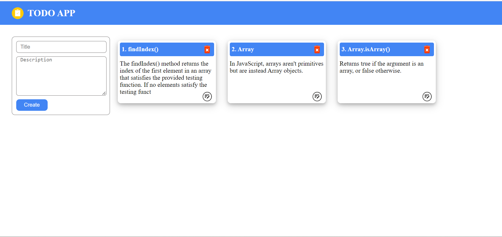
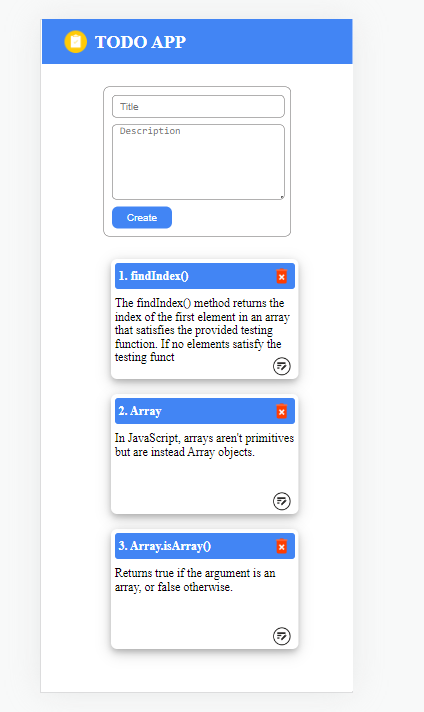

# ToDo List WebApp  | JavaScript Project

Hi, I am **Vipransh Verma**

This projet is part of my learning from Full Stack JavaScript developer Bootcamp by Hitesh Sir.

## Learning Experience
It was an amazing experience to learn about  Dom(Document Object Model) manipulation conceps and CRUD operations with Local storage in JavaScript.

## Features
1. Create Todo List
2. Update Todo List
3. Read Todo List
4. Delete Todo List

[Live-Link]()

